# 📊 Dashboard de Portfolio Tracking

## Tabla de Contenidos

1. [Descripción General](#descripción-general)
2. [Arquitectura del Sistema](#arquitectura-del-sistema)
3. [Interfaz de Usuario](#interfaz-de-usuario)
4. [Funcionalidades Principales](#funcionalidades-principales)
5. [Métricas y Cálculos](#métricas-y-cálculos)
6. [Almacenamiento de Datos](#almacenamiento-de-datos)
7. [Flujo de Trabajo](#flujo-de-trabajo)
8. [API y Módulos](#api-y-módulos)

---

## Descripción General

El **Dashboard de Portfolio Tracking** es un sistema completo de seguimiento y análisis de carteras de inversión que permite a los usuarios:

- **Guardar y gestionar** múltiples portfolios
- **Visualizar en tiempo real** el valor y P&L de sus inversiones
- **Analizar el rendimiento** con métricas cuantitativas profesionales
- **Comparar** el rendimiento contra benchmarks de mercado
- **Recibir alertas** automáticas sobre riesgos y desviaciones
- **Consultar histórico** completo de rebalanceos y cambios

### Características Destacadas

✅ **100% Client-Side**: No requiere backend, usa IndexedDB para persistencia local
✅ **Tiempo Real**: Actualización automática de precios vía API de Yahoo Finance
✅ **Profesional**: Métricas de nivel institucional (Sharpe, Sortino, VaR, CVaR)
✅ **Visual**: Gráficos interactivos con Chart.js
✅ **Multiidioma**: Soporte completo para Español e Inglés
✅ **Responsive**: Diseño adaptable a diferentes pantallas

---

## Arquitectura del Sistema

### Diagrama de Componentes

```
┌─────────────────────────────────────────────────────────────┐
│                      INTERFAZ DE USUARIO                     │
│  ┌─────────────┐  ┌──────────────┐  ┌──────────────────┐   │
│  │  Selector   │  │   Cards de   │  │  Tabs de Vistas  │   │
│  │  Portfolio  │  │   Métricas   │  │  (4 gráficos)    │   │
│  └─────────────┘  └──────────────┘  └──────────────────┘   │
│  ┌─────────────────────────────────────────────────────┐    │
│  │         Tabla de Posiciones con P&L                 │    │
│  └─────────────────────────────────────────────────────┘    │
│  ┌─────────────┐  ┌────────────────────────────────────┐   │
│  │  Métricas   │  │  Histórico de Rebalanceos         │    │
│  │  de Riesgo  │  │  y Sistema de Alertas             │    │
│  └─────────────┘  └────────────────────────────────────┘   │
└─────────────────────────────────────────────────────────────┘
                              ↓
┌─────────────────────────────────────────────────────────────┐
│                    CAPA DE CONTROLADORES                     │
│  ┌──────────────────────────────────────────────────────┐   │
│  │  portfolio-dashboard.js                              │   │
│  │  • Gestión de estado                                 │   │
│  │  • Renderizado de UI                                 │   │
│  │  • Manejo de eventos                                 │   │
│  │  • Integración con Chart.js                          │   │
│  └──────────────────────────────────────────────────────┘   │
└─────────────────────────────────────────────────────────────┘
                              ↓
┌─────────────────────────────────────────────────────────────┐
│                     CAPA DE LÓGICA DE NEGOCIO                │
│  ┌──────────────────────┐  ┌─────────────────────────────┐ │
│  │  PortfolioManager    │  │  PerformanceTracker         │ │
│  │  • CRUD portfolios   │  │  • Cálculo de P&L           │ │
│  │  • Snapshots         │  │  • Equity curve             │ │
│  │  • Rebalanceos       │  │  • Drawdowns                │ │
│  │  • Posiciones        │  │  • Métricas de riesgo       │ │
│  │                      │  │  • Comparación benchmark    │ │
│  └──────────────────────┘  └─────────────────────────────┘ │
└─────────────────────────────────────────────────────────────┘
                              ↓
┌─────────────────────────────────────────────────────────────┐
│                    CAPA DE PERSISTENCIA                      │
│  ┌──────────────────────────────────────────────────────┐   │
│  │  IndexedDBStore                                      │   │
│  │  • portfolios (Object Store)                         │   │
│  │  • snapshots (Object Store)                          │   │
│  │  • rebalances (Object Store)                         │   │
│  │  • price_cache (Object Store)                        │   │
│  └──────────────────────────────────────────────────────┘   │
└─────────────────────────────────────────────────────────────┘
                              ↓
┌─────────────────────────────────────────────────────────────┐
│                       FUENTES DE DATOS                       │
│  ┌──────────────────────┐  ┌─────────────────────────────┐ │
│  │  Yahoo Finance API   │  │  Risk Engine (local)        │ │
│  │  • Precios actuales  │  │  • Cálculos de correlación  │ │
│  │  • Datos históricos  │  │  • Matrices de covarianza   │ │
│  │  • Benchmarks        │  │  • VaR / CVaR               │ │
│  └──────────────────────┘  └─────────────────────────────┘ │
└─────────────────────────────────────────────────────────────┘
```

### Módulos Principales

| Módulo | Archivo | Responsabilidad |
|--------|---------|-----------------|
| **UI Dashboard** | `src/dashboard/portfolio-dashboard.js` | Interfaz y visualización |
| **Portfolio Manager** | `src/portfolio/portfolio-manager.js` | Gestión de portfolios |
| **Performance Tracker** | `src/portfolio/performance-tracker.js` | Cálculos de rendimiento |
| **Storage Layer** | `src/storage/indexed-db-store.js` | Persistencia de datos |
| **Risk Engine** | `src/analytics/risk_engine.js` | Métricas de riesgo |

---

## Interfaz de Usuario

### Vista General del Dashboard


### Sección 1: Control y Selección

```
┌──────────────────────────────────────────────────────────┐
│  Seleccionar Portfolio: [Dropdown ▼]                     │
│                                                           │
│  [💾 Guardar Portfolio] [🗑️ Eliminar] [🔄 Actualizar]   │
└──────────────────────────────────────────────────────────┘
```

**Elementos:**
- **Dropdown de Portfolios**: Lista de todos los portfolios guardados
- **Botón Guardar**: Guarda el portfolio actual desde el constructor
- **Botón Eliminar**: Elimina el portfolio seleccionado (con confirmación)
- **Botón Actualizar**: Refresca los datos y precios actuales

### Sección 2: Cards de Métricas Principales

```
┌──────────────┬──────────────┬──────────────┬──────────────┐
│ Valor Total  │ Retorno      │ Sharpe Ratio │ Max Drawdown │
│   $10,542    │   +5.42%     │     1.85     │    -8.32%    │
└──────────────┴──────────────┴──────────────┴──────────────┘
┌──────────────┬──────────────┐
│ Volatilidad  │    Beta      │
│   15.32%     │    0.92      │
└──────────────┴──────────────┘
```

**Colores Dinámicos:**
- 🟢 Verde: Valores positivos (retornos, ratios buenos)
- 🔴 Rojo: Valores negativos (pérdidas, drawdowns)
- ⚪ Blanco: Valores neutros (volatilidad, beta)

### Sección 3: Tabs de Visualización

```
┌─────────────────────────────────────────────────────────┐
│  [Equity Curve] [Drawdown] [vs Benchmark] [Asignación] │
├─────────────────────────────────────────────────────────┤
│                                                         │
│          [Gráfico interactivo Chart.js]                │
│                                                         │
│              (400px altura mínima)                     │
│                                                         │
└─────────────────────────────────────────────────────────┘
```

#### Tab 1: Equity Curve
- **Tipo**: Line chart
- **Eje X**: Fechas (formato: YYYY-MM-DD)
- **Eje Y**: Valor en dólares ($)
- **Características**:
  - Relleno degradado bajo la línea
  - Tooltips interactivos
  - Zoom y pan habilitados
  - Color: Verde (#10b981)

#### Tab 2: Drawdown
- **Tipo**: Line chart (área negativa)
- **Eje X**: Fechas
- **Eje Y**: Porcentaje de drawdown (%)
- **Características**:
  - Muestra la distancia del pico máximo
  - Identifica periodos de pérdida
  - Color: Rojo (#ef4444)

#### Tab 3: vs Benchmark
- **Tipo**: Multi-line chart
- **Eje X**: Fechas
- **Eje Y**: Retorno porcentual (%)
- **Líneas**:
  - Portfolio (verde)
  - Benchmark (azul)
- **Información adicional**:
  - Alpha y Beta mostrados
  - Excess return calculado

#### Tab 4: Asignación
- **Tipo**: Doughnut chart
- **Datos**: Peso de cada posición (%)
- **Características**:
  - Colores distintivos por activo
  - Tooltips con porcentajes exactos
  - Leyenda lateral

### Sección 4: Tabla de Posiciones

```
┌──────────────────────────────────────────────────────────────────────────┐
│ Ticker │ Nombre  │ Cant │ P.Entrada│ P.Actual │ Valor  │ Peso │ P&L │ P&L%│
├────────┼─────────┼──────┼──────────┼──────────┼────────┼──────┼─────┼─────┤
│ AAPL   │ Apple   │ 50   │ $150.00  │ $165.50  │ $8,275 │ 32.1%│ +$775│+10.3%│
│ MSFT   │Microsoft│ 30   │ $320.00  │ $310.25  │ $9,307 │ 36.1%│ -$292│ -3.0%│
│ GOOGL  │Alphabet │ 25   │ $125.00  │ $135.80  │ $3,395 │ 13.2%│ +$270│ +8.6%│
│ TSLA   │ Tesla   │ 40   │ $200.00  │ $195.50  │ $7,820 │ 30.4%│ -$180│ -2.2%│
└────────┴─────────┴──────┴──────────┴──────────┴────────┴──────┴─────┴─────┘
```

**Columnas:**
1. **Ticker**: Símbolo del activo (color azul)
2. **Nombre**: Nombre completo de la empresa
3. **Cantidad**: Número de acciones
4. **Precio Entrada**: Precio de compra promedio
5. **Precio Actual**: Último precio conocido
6. **Valor**: Valor total de la posición (cantidad × precio actual)
7. **Peso %**: Porcentaje del portfolio
8. **P&L**: Ganancia/pérdida en dólares (color según signo)
9. **P&L %**: Ganancia/pérdida porcentual (color según signo)

### Sección 5: Métricas de Riesgo Detalladas

```
┌─────────────────────────────────────────────────────────┐
│  ⚠️ Métricas de Riesgo Detalladas                      │
├──────────────┬──────────────┬──────────────┬───────────┤
│ VaR (95%)    │ CVaR         │ Sortino      │ Calmar    │
│ -2.35%       │ -3.12%       │  1.92        │  1.45     │
│ 1 día        │ Expected     │ Downside     │ Ret/MaxDD │
│              │ Shortfall    │ adjusted     │           │
└──────────────┴──────────────┴──────────────┴───────────┘
```

**Métricas explicadas:**

- **VaR (Value at Risk)**: Pérdida máxima esperada con 95% de confianza en 1 día
- **CVaR (Conditional VaR)**: Pérdida promedio en el peor 5% de casos
- **Sortino Ratio**: Similar a Sharpe pero solo penaliza volatilidad negativa
- **Calmar Ratio**: Retorno anualizado dividido por max drawdown

### Sección 6: Histórico de Rebalanceos

```
┌─────────────────────────────────────────────────────────┐
│  🔄 Histórico de Rebalanceos                           │
├─────────────────────────────────────────────────────────┤
│  📅 2025-01-04 15:30:00          5 cambios             │
│  Motivo: Drift superior al 5% desde último rebalanceo  │
│                                                         │
│  📅 2024-12-15 10:15:00          3 cambios             │
│  Motivo: Rebalanceo mensual programado                 │
└─────────────────────────────────────────────────────────┘
```

**Información mostrada:**
- Fecha y hora exacta del rebalanceo
- Número de posiciones modificadas
- Motivo/razón del rebalanceo
- Al hacer clic: detalles de cambios específicos

### Sección 7: Alertas y Desviaciones

```
┌─────────────────────────────────────────────────────────┐
│  ⚠️ Alertas y Desviaciones                             │
├─────────────────────────────────────────────────────────┤
│  ⚠️ Drawdown significativo detectado: -12.5%           │
│                                                         │
│  ⚠️ Alta concentración en AAPL: 32.1%                  │
│                                                         │
│  ℹ️ Underperformance vs benchmark: -2.3%               │
└─────────────────────────────────────────────────────────┘
```

**Tipos de alertas:**
- 🔴 **Warning** (amarillo): Requieren atención
  - Drawdown > 15%
  - Concentración > 25% en un activo
  - Deriva > 5% de pesos objetivo

- 🔵 **Info** (azul): Informativas
  - Underperformance vs benchmark
  - Cambios en volatilidad
  - Oportunidades de rebalanceo

---

## Funcionalidades Principales

### 1. Creación y Guardado de Portfolios

**Flujo de trabajo:**

```mermaid
graph LR
    A[Escanear Mercado] --> B[Seleccionar Activos]
    B --> C[Build Portfolio]
    C --> D[Revisar Asignación]
    D --> E[Click: Guardar Portfolio]
    E --> F[Ingresar Nombre]
    F --> G[Portfolio Guardado en IndexedDB]
    G --> H[Aparece en Selector]
```



**Código de uso:**

```javascript
// El usuario construye un portfolio en la UI
// Luego hace clic en "Guardar Portfolio"

// Internamente se ejecuta:
await portfolioManager.createPortfolio(
  'Mi Portfolio Tech',
  selectedAssets,
  {
    strategy: 'momentum_aggressive',
    allocation_method: 'equal_weight',
    benchmark: '^GSPC',
    initial_capital: 10000
  }
);
```

### 2. Cálculo de P&L en Tiempo Real

**Proceso:**

1. Usuario selecciona portfolio del dropdown
2. Sistema carga precios actuales vía API
3. Calcula P&L por posición:
   ```
   P&L = (Precio Actual - Precio Entrada) × Cantidad
   P&L% = (Precio Actual - Precio Entrada) / Precio Entrada × 100
   ```
4. Actualiza tabla y cards en tiempo real

**Actualización automática:**
- Al seleccionar portfolio
- Al hacer clic en "Actualizar"
- Al cambiar de tab de visualización

### 3. Generación de Equity Curve

**Algoritmo:**

```javascript
// 1. Obtener rango de fechas
const from = portfolio.created_at;
const to = today;

// 2. Para cada día laborable
for (const date of businessDays(from, to)) {
  // 3. Obtener precios de todos los activos
  const prices = await loadPricesForDate(date);

  // 4. Calcular valor del portfolio
  let totalValue = 0;
  for (const position of portfolio.positions) {
    totalValue += position.quantity * prices[position.ticker];
  }

  // 5. Agregar punto a la curva
  equityCurve.push({
    date,
    value: totalValue,
    return_pct: (totalValue - initialCapital) / initialCapital * 100
  });
}
```

### 4. Comparación con Benchmark

**Proceso:**

1. Cargar datos del benchmark (ej: S&P 500)
2. Normalizar el benchmark al capital inicial
3. Calcular métricas comparativas:

```javascript
// Beta (sensibilidad al mercado)
beta = covariance(portfolioReturns, benchmarkReturns)
       / variance(benchmarkReturns)

// Alpha (exceso de retorno ajustado por riesgo)
alpha = portfolioReturn - (riskFreeRate + beta * benchmarkExcessReturn)

// Tracking Error (volatilidad de diferencia de retornos)
trackingError = std(portfolioReturns - benchmarkReturns)
```

### 5. Sistema de Snapshots

**Funcionamiento:**

Los snapshots capturan el estado del portfolio en un momento específico:

```javascript
const snapshot = {
  portfolio_id: 'abc123',
  date: '2025-01-04',
  positions: [
    { ticker: 'AAPL', price: 165.50, quantity: 50, value: 8275, weight: 0.32 },
    // ... más posiciones
  ],
  total_value: 25797,
  daily_return: 0.85,      // % de cambio desde ayer
  cumulative_return: 5.42  // % de cambio desde inicio
};
```

**Ventajas:**
- Histórico completo sin recalcular
- Análisis de tendencias a largo plazo
- Base para reportes y auditoría

### 6. Rebalanceo Automático

**Criterios de detección:**

```javascript
function needsRebalancing(portfolio, threshold = 0.05) {
  for (const position of portfolio.positions) {
    const drift = Math.abs(
      position.current_weight - position.target_weight
    );

    if (drift > threshold) {
      return true; // Necesita rebalanceo
    }
  }
  return false;
}
```

**Ejecución:**

1. Detectar posiciones con deriva > 5%
2. Calcular nuevas cantidades según pesos objetivo
3. Registrar cambios en histórico:
   ```javascript
   {
     ticker: 'AAPL',
     old_quantity: 50,
     new_quantity: 55,
     quantity_change: +5,
     reason: 'Drift del peso objetivo',
     price: 165.50
   }
   ```
4. Actualizar portfolio
5. Crear nuevo snapshot

---

## Métricas y Cálculos

### Métricas de Rendimiento

#### 1. Retorno Total
```
Retorno Total = (Valor Final - Valor Inicial) / Valor Inicial × 100
```

#### 2. Retorno Anualizado
```
Retorno Anualizado = (1 + Retorno Total)^(252/Días) - 1
```
*252 = número de días de trading al año*

#### 3. Sharpe Ratio
```
Sharpe = (Retorno Portfolio - Tasa Libre Riesgo) / Volatilidad Portfolio
```

**Interpretación:**
- > 2.0: Excelente
- 1.0 - 2.0: Muy bueno
- 0.5 - 1.0: Bueno
- < 0.5: Pobre

#### 4. Sortino Ratio
```
Sortino = (Retorno Portfolio - Tasa Libre Riesgo) / Downside Deviation
```

Similar a Sharpe pero solo penaliza volatilidad negativa (más realista).

#### 5. Calmar Ratio
```
Calmar = Retorno Anualizado / |Max Drawdown|
```

Mide retorno vs peor caída histórica.

### Métricas de Riesgo

#### 1. Volatilidad (Desviación Estándar)
```
σ = √(Σ(retorno_i - retorno_promedio)² / n)
```

Anualizada: `σ_anual = σ_diaria × √252`

#### 2. Maximum Drawdown
```
Max DD = (Trough Value - Peak Value) / Peak Value × 100
```

Identifica la peor caída desde un pico histórico.

#### 3. Value at Risk (VaR)
```
VaR_95% = μ - 1.65 × σ
```

Pérdida máxima esperada en el peor 5% de casos (95% confianza).

#### 4. Conditional VaR (CVaR)
```
CVaR = E[Pérdida | Pérdida > VaR]
```

Pérdida promedio cuando se supera el VaR (peor escenario).

#### 5. Beta
```
β = Cov(r_portfolio, r_market) / Var(r_market)
```

**Interpretación:**
- β = 1: Se mueve igual que el mercado
- β > 1: Más volátil que el mercado
- β < 1: Menos volátil que el mercado

#### 6. Alpha
```
α = r_portfolio - [r_f + β × (r_market - r_f)]
```

Exceso de retorno no explicado por el mercado (skill del gestor).

---

## Almacenamiento de Datos

### IndexedDB Schema

#### Object Store: `portfolios`

```javascript
{
  id: string,              // UUID único
  name: string,            // "Mi Portfolio Tech"
  description: string,     // Opcional
  created_at: ISO8601,     // "2025-01-04T10:30:00Z"
  last_updated: ISO8601,
  positions: [
    {
      ticker: string,
      name: string,
      sector: string,
      entry_price: number,
      entry_date: ISO8601,
      quantity: number,
      target_weight: number,  // 0-1
      current_weight: number, // 0-1
      score: number,          // Del análisis original
      volatility: number
    }
  ],
  benchmark: string,        // "^GSPC"
  strategy: string,         // "balanced"
  allocation_method: string,// "equal_weight"
  initial_capital: number,  // 10000
  current_value: number,    // Actualizado con precios
  total_return: number,
  total_return_pct: number,
  status: string           // "active" | "closed" | "archived"
}
```

**Índices:**
- `created_at`: Para ordenar por fecha
- `last_updated`: Para encontrar portfolios recientes
- `name`: Para búsqueda por nombre

#### Object Store: `snapshots`

```javascript
{
  portfolio_id: string,    // FK a portfolios
  date: string,            // "2025-01-04" (YYYY-MM-DD)
  positions: [
    {
      ticker: string,
      price: number,
      quantity: number,
      value: number,
      weight: number,
      unrealized_pnl: number,
      unrealized_pnl_pct: number
    }
  ],
  total_value: number,
  daily_return: number,
  cumulative_return: number,
  benchmark_value: number,    // Opcional
  benchmark_return: number    // Opcional
}
```

**Clave primaria compuesta:** `[portfolio_id, date]`

**Índices:**
- `portfolio_id`: Para obtener snapshots de un portfolio
- `date`: Para filtrar por rango de fechas

#### Object Store: `rebalances`

```javascript
{
  id: string,
  portfolio_id: string,
  timestamp: ISO8601,
  reason: string,          // "Drift > 5%", "Rebalanceo mensual"
  before_positions: [...], // Estado antes del rebalanceo
  after_positions: [...],  // Estado después
  changes: [
    {
      ticker: string,
      old_quantity: number,
      new_quantity: number,
      quantity_change: number,
      price: number,
      old_weight: number,
      new_weight: number
    }
  ],
  total_value: number
}
```

**Índices:**
- `portfolio_id`: Histórico por portfolio
- `timestamp`: Ordenar cronológicamente

#### Object Store: `price_cache`

```javascript
{
  ticker: string,
  date: string,           // "2025-01-04"
  price: number           // Closing price
}
```

**Clave primaria compuesta:** `[ticker, date]`

**Propósito:** Evitar llamadas repetidas a la API de Yahoo Finance.

---

## Flujo de Trabajo

### Caso de Uso 1: Crear Primer Portfolio

```
1. Usuario → Escanea mercado US con estrategia "Momentum Aggressive"
2. Sistema → Analiza 500 acciones, devuelve top 50
3. Usuario → Selecciona 10 acciones con mejor score
4. Usuario → Click "Build Portfolio" con método "Equal Weight"
5. Sistema → Calcula pesos (10% cada acción)
6. Usuario → Click "Guardar Portfolio" en dashboard
7. Sistema → Prompt "Nombre del portfolio"
8. Usuario → Ingresa "Tech Leaders Q1 2025"
9. Sistema →
   - Crea portfolio en IndexedDB
   - Genera ID único
   - Guarda posiciones con precios actuales
   - Crea snapshot inicial
10. Sistema → Actualiza selector de portfolios
11. Sistema → Carga y muestra el dashboard
```

### Caso de Uso 2: Revisar Portfolio Existente

```
1. Usuario → Abre aplicación
2. Dashboard → Muestra selector con portfolios guardados
3. Usuario → Selecciona "Tech Leaders Q1 2025"
4. Sistema →
   - Carga portfolio de IndexedDB
   - Obtiene precios actuales (Yahoo API)
   - Calcula P&L por posición
   - Calcula métricas de rendimiento
   - Genera equity curve desde snapshots
   - Compara con benchmark
5. Dashboard → Renderiza:
   - Cards con métricas actualizadas
   - Tabla de posiciones con P&L
   - Gráfico de equity curve
   - Alertas si las hay
6. Usuario → Cambia a tab "vs Benchmark"
7. Sistema →
   - Carga datos de ^GSPC
   - Normaliza al capital inicial
   - Calcula alpha y beta
   - Renderiza gráfico comparativo
```

### Caso de Uso 3: Rebalancear Portfolio

```
1. Sistema → Detecta drift en posiciones
   - AAPL: peso actual 35% vs objetivo 10% → +25% drift
   - TSLA: peso actual 8% vs objetivo 10% → -2% drift
2. Dashboard → Muestra alerta:
   "⚠️ Alta concentración en AAPL: 35%"
3. Usuario → Revisa alertas y decide rebalancear
4. Sistema → Calcula nuevas cantidades:
   - Valor total: $10,500
   - AAPL: $3,675 → Debe ser $1,050 (10%)
   - Vender: (3675-1050) / precio = X acciones
5. Usuario → Confirma (futura feature, por ahora manual)
6. Sistema →
   - Registra rebalanceo en histórico
   - Actualiza cantidades
   - Crea nuevo snapshot
   - Muestra cambios en histórico
```

---

## API y Módulos

### PortfolioManager API

```javascript
import { portfolioManager } from '../portfolio/portfolio-manager.js';

// Crear portfolio
const portfolio = await portfolioManager.createPortfolio(
  name,      // string
  assets,    // array de assets del scanner
  options    // { strategy, allocation_method, benchmark, initial_capital }
);

// Cargar portfolio
const portfolio = await portfolioManager.loadPortfolio(id);

// Obtener todos los portfolios
const portfolios = await portfolioManager.getAllPortfolios();

// Actualizar portfolio
await portfolioManager.updatePortfolio(id, { current_value: 11000 });

// Eliminar portfolio
await portfolioManager.deletePortfolio(id);

// Agregar posición
await portfolioManager.addPosition(portfolioId, position);

// Remover posición
await portfolioManager.removePosition(portfolioId, ticker);

// Crear snapshot
await portfolioManager.createSnapshot(portfolio, priceData);

// Obtener equity curve
const curve = await portfolioManager.getEquityCurve(portfolioId);

// Ejecutar rebalanceo
const rebalance = await portfolioManager.executeRebalance(
  portfolioId,
  reason,
  priceData
);

// Obtener histórico de rebalanceos
const history = await portfolioManager.getRebalanceHistory(portfolioId);
```

### PerformanceTracker API

```javascript
import { performanceTracker } from '../portfolio/performance-tracker.js';

// Calcular P&L actual
const pnl = await performanceTracker.calculatePnL(portfolio);
// Retorna: { positions, total_value, total_pnl, total_pnl_pct }

// Calcular equity curve
const curve = await performanceTracker.calculateEquityCurve(
  portfolio,
  fromDate, // opcional
  toDate    // opcional
);

// Calcular drawdowns
const drawdowns = performanceTracker.calculateDrawdowns(equityCurve);

// Calcular max drawdown
const maxDD = performanceTracker.calculateMaxDrawdown(equityCurve);

// Calcular métricas de performance
const metrics = performanceTracker.calculatePerformanceMetrics(
  equityCurve,
  riskFreeRate // default: 0.02
);
// Retorna: { sharpe_ratio, sortino_ratio, calmar_ratio, etc. }

// Comparar con benchmark
const comparison = await performanceTracker.compareToBenchmark(
  portfolio,
  portfolioEquity
);
// Retorna: { alpha, beta, tracking_error, excess_return, etc. }

// Cargar precios actuales
const prices = await performanceTracker.loadCurrentPrices(tickers);
```

### Dashboard Controller API

```javascript
import {
  initDashboard,
  loadPortfolio,
  refreshDashboard,
  switchChartTab
} from '../dashboard/portfolio-dashboard.js';

// Inicializar dashboard (automático en DOMContentLoaded)
await initDashboard();

// Cargar un portfolio específico
await loadPortfolio(portfolioId);

// Refrescar datos (actualizar precios y recalcular)
await refreshDashboard();

// Cambiar tab de visualización
switchChartTab('equity' | 'drawdown' | 'benchmark' | 'allocation');
```

### IndexedDB Store API

```javascript
import { dbStore } from '../storage/indexed-db-store.js';

// Inicializar (automático en primera llamada)
await dbStore.init();

// Portfolios
await dbStore.savePortfolio(portfolio);
const portfolio = await dbStore.getPortfolio(id);
const all = await dbStore.getAllPortfolios();
await dbStore.deletePortfolio(id);

// Snapshots
await dbStore.saveSnapshot(snapshot);
const snapshots = await dbStore.getSnapshots(portfolioId, from, to);

// Rebalances
await dbStore.saveRebalance(rebalance);
const history = await dbStore.getRebalanceHistory(portfolioId);

// Price cache
await dbStore.savePriceCache(ticker, date, price);
const prices = await dbStore.getPriceCache(ticker, from, to);

// Utilidades
await dbStore.clearAll(); // ⚠️ Elimina todos los datos
```

---

## Ejemplos de Código

### Ejemplo 1: Guardar Portfolio desde Constructor

```javascript
// En la UI, después de construir portfolio
document.getElementById('savePortfolioBtn').addEventListener('click', async () => {
  const name = prompt('Ingresa un nombre para el portfolio:');
  if (!name) return;

  try {
    // Obtener portfolio del estado global
    const currentPortfolio = window.appState.portfolio;

    if (!currentPortfolio) {
      alert('Primero construye un portfolio');
      return;
    }

    // Crear portfolio persistente
    const portfolio = await portfolioManager.createPortfolio(
      name,
      currentPortfolio.assets,
      {
        strategy: window.appState.strategy || 'balanced',
        allocation_method: currentPortfolio.allocation_method,
        benchmark: window.appState.benchmark || '^GSPC',
        initial_capital: 10000
      }
    );

    alert('Portfolio guardado exitosamente!');

    // Cargar en dashboard
    await loadPortfolio(portfolio.id);

  } catch (error) {
    console.error('Error:', error);
    alert('Error al guardar portfolio');
  }
});
```

### Ejemplo 2: Calcular y Mostrar P&L

```javascript
async function displayPnL(portfolio) {
  // Calcular P&L
  const pnl = await performanceTracker.calculatePnL(portfolio);

  // Actualizar card de resumen
  document.getElementById('totalValueCard').textContent =
    `$${pnl.total_value.toLocaleString('en-US', {
      minimumFractionDigits: 2
    })}`;

  const returnCard = document.getElementById('totalReturnCard');
  returnCard.textContent =
    `${pnl.total_pnl_pct >= 0 ? '+' : ''}${pnl.total_pnl_pct.toFixed(2)}%`;
  returnCard.style.color = pnl.total_pnl_pct >= 0 ? '#10b981' : '#ef4444';

  // Actualizar tabla de posiciones
  const tbody = document.getElementById('positionsTableBody');
  tbody.innerHTML = pnl.positions.map(pos => {
    const pnlColor = pos.unrealized_pnl >= 0 ? '#10b981' : '#ef4444';
    return `
      <tr>
        <td>${pos.ticker}</td>
        <td>${pos.name}</td>
        <td>${pos.quantity}</td>
        <td>$${pos.entry_price.toFixed(2)}</td>
        <td>$${pos.current_price.toFixed(2)}</td>
        <td>$${pos.current_value.toLocaleString()}</td>
        <td>${pos.weight.toFixed(2)}%</td>
        <td style="color: ${pnlColor}">
          ${pos.unrealized_pnl >= 0 ? '+' : ''}$${pos.unrealized_pnl.toFixed(2)}
        </td>
        <td style="color: ${pnlColor}">
          ${pos.unrealized_pnl_pct >= 0 ? '+' : ''}${pos.unrealized_pnl_pct.toFixed(2)}%
        </td>
      </tr>
    `;
  }).join('');
}
```

### Ejemplo 3: Generar Gráfico de Equity Curve

```javascript
function createEquityCurveChart(equityCurve) {
  const canvas = document.getElementById('portfolioChart');
  const ctx = canvas.getContext('2d');

  return new Chart(ctx, {
    type: 'line',
    data: {
      labels: equityCurve.map(p => p.date),
      datasets: [{
        label: 'Valor del Portfolio',
        data: equityCurve.map(p => p.value),
        borderColor: '#10b981',
        backgroundColor: 'rgba(16, 185, 129, 0.1)',
        borderWidth: 2,
        fill: true,
        tension: 0.4,
        pointRadius: 0,
        pointHoverRadius: 5
      }]
    },
    options: {
      responsive: true,
      maintainAspectRatio: false,
      plugins: {
        legend: {
          labels: { color: '#e2e8f0' }
        },
        tooltip: {
          mode: 'index',
          intersect: false,
          backgroundColor: '#0f172a',
          titleColor: '#e2e8f0',
          bodyColor: '#94a3b8',
          borderColor: '#334155',
          borderWidth: 1,
          callbacks: {
            label: (context) => {
              const value = context.parsed.y;
              return `Valor: $${value.toLocaleString('en-US', {
                minimumFractionDigits: 2
              })}`;
            }
          }
        }
      },
      scales: {
        x: {
          ticks: {
            color: '#94a3b8',
            maxTicksLimit: 10
          },
          grid: { color: '#334155' }
        },
        y: {
          ticks: {
            color: '#94a3b8',
            callback: value => '$' + value.toLocaleString()
          },
          grid: { color: '#334155' }
        }
      }
    }
  });
}
```

---

## Mejores Prácticas

### 1. Performance

- ✅ **Cachear precios**: Usar `price_cache` para evitar llamadas repetidas a API
- ✅ **Lazy loading**: Cargar gráficos solo cuando se cambia de tab
- ✅ **Throttling**: Limitar actualizaciones a máximo 1 por segundo
- ✅ **Indexes**: Usar índices de IndexedDB para queries rápidas

### 2. Precisión de Datos

- ✅ **Snapshots diarios**: Guardar estado al final del día para histórico exacto
- ✅ **Precios de cierre**: Usar closing prices, no intraday
- ✅ **Alineación de fechas**: Solo business days en equity curve
- ✅ **Manejo de splits/dividendos**: Ajustar precios históricos (future feature)

### 3. UX

- ✅ **Feedback inmediato**: Mostrar loading states durante cálculos
- ✅ **Confirmaciones**: Pedir confirmación antes de eliminar
- ✅ **Tooltips**: Explicar métricas complejas con hover text
- ✅ **Responsive**: Adaptar layout a mobile/tablet

### 4. Seguridad

- ✅ **Client-side only**: No exponer APIs sensibles
- ✅ **Validación**: Validar todos los inputs del usuario
- ✅ **Sanitización**: Escapar HTML en nombres de portfolios
- ✅ **Rate limiting**: Limitar llamadas a APIs externas

---

## Troubleshooting

### Problema: No aparecen los portfolios guardados

**Solución:**
1. Verificar consola del navegador: `await dbStore.getAllPortfolios()`
2. Revisar que IndexedDB está habilitado (no modo incógnito)
3. Limpiar caché: `await dbStore.clearAll()` y recrear

### Problema: Precios no se actualizan

**Solución:**
1. Verificar conectividad a Yahoo Finance API
2. Revisar símbolos de tickers (deben ser válidos)
3. Comprobar límite de rate limiting
4. Ver logs de red en DevTools

### Problema: Gráficos no se muestran

**Solución:**
1. Verificar que Chart.js se cargó correctamente
2. Revisar consola de JavaScript por errores
3. Asegurar que hay datos en `equityCurve`
4. Verificar dimensiones del canvas (min-height: 400px)

### Problema: Métricas incorrectas

**Solución:**
1. Verificar que hay suficientes datos (mínimo 30 días)
2. Revisar que los retornos están bien calculados
3. Comprobar que fechas están alineadas
4. Validar que no hay valores NaN o Infinity

---

## Roadmap Futuro

### Próximas Features

1. **Exportación de reportes**
   - PDF con resumen ejecutivo
   - CSV de transacciones
   - Excel con análisis detallado

2. **Múltiples portfolios comparativos**
   - Vista side-by-side
   - Performance relativa
   - Consolidación de portfolios

3. **Alertas configurables**
   - Threshold personalizado
   - Notificaciones por email
   - Webhooks a servicios externos

4. **Análisis de atribución**
   - Retorno por sector
   - Retorno por activo
   - Retorno por factor (momentum, value, etc.)

5. **Optimización de portfolios**
   - Markowitz mean-variance
   - Black-Litterman
   - Hierarchical Risk Parity
   - Monte Carlo simulation

6. **Integración con brokers**
   - Sincronización automática de posiciones
   - Ejecución de órdenes
   - Tracking de comisiones reales

---

## Conclusión

El Dashboard de Portfolio Tracking es un sistema completo y profesional que permite a los usuarios gestionar sus inversiones con el mismo nivel de análisis que usan los profesionales institucionales.

**Características clave:**
- ✅ 100% local, sin necesidad de backend
- ✅ Métricas de nivel institucional
- ✅ Visualizaciones interactivas
- ✅ Multiidioma y responsive
- ✅ Extensible y modular

Para más información, consulta:
- [Roadmap del proyecto](roadmap.md)
- [Documentación de API](../README.md)
- Código fuente en `src/dashboard/`, `src/portfolio/`, `src/storage/`
